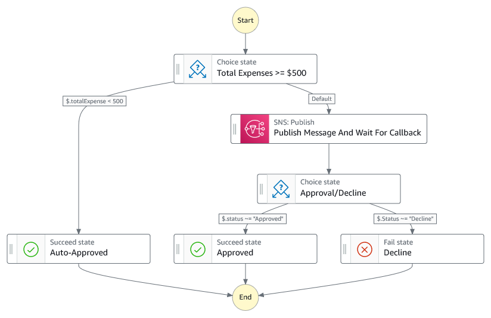

# AWS Stepfunctions SNS Human Approvals

Step by step instructions to setup AWS stepfunctions SNS API for Human Approvals.



### Description
AWS Step Functions supports over 200 AWS service integrations. As of today, it includes direct integration with over 220 AWS services and more than 10,000 APIs. This demonstrates accessing Amazon SNS API instead of using other compute layers such as Lambda.

## Getting Started
### Pre-requisites
* AWS Account with appropriate permissions
* Services in scope
  - AWS Step functions
  - Amazon SNS
  - Amazon API Gateway
  - AWS Lambda
  
#### Environment setup
#### 1. Clone GitRepo to local machine
Create a folder named "stepfunctionsSns"

```
mkdir stepfunctionsSns && cd stepfunctionsSns

```
Clone the GitRepo to your local machine.
```
git clone https://github.com/SridharChevendra/sfSnsHumanApprovals.git
cd sfSnsHumanApprovals
```
#### 2. AWS stack deployment
##### CFN Deployment
With in your AWS console,
1. Go to Cloudformation, use the "template.yaml" on the root of the repo to create stack.
2. Create stack(provide a stack name. For example: "sfSnsApproval")
3. Accept the default parameters and deploy stack

##### SNS Subscription
Once the stack is created successfully, Subscribe SNS messages to your e-mail address.
Confirm the subscription to receive the messages.
```
You have chosen to subscribe to the topic: 
arn:aws:sns:us-east-1:<AWS ACCOUNT ID>:expense-approval-topic
To confirm this subscription, click or visit the link below (If this was in error no action is necessary): 
Confirm subscription
Please do not reply directly to this email. If you wish to remove yourself from receiving all future SNS subscription confirmation requests please send an email to sns-opt-out
```

#### 3. Test Workflow
1. In the cloudformation outputs, identify the step function name
2. With in the stepfunctions service open the stepfunction that created, "Start Execution"
3. Use the following payload in the input section.
```
{
  "employeeId": "EMP12345",
  "employeeName": "Jane Doe",
  "expenseReportId": "ER98765",
  "submissionDate": "2024-09-25T14:30:00Z",
  "totalExpense": 750.50,
  "currency": "USD",
  "transactions": [
    {
      "transactionId": "T001",
      "date": "2024-09-20",
      "category": "Travel",
      "description": "Flight to New York",
      "amount": 450.00
    },
    {
      "transactionId": "T002",
      "date": "2024-09-21",
      "category": "Accommodation",
      "description": "Hotel stay - 2 nights",
      "amount": 300.50
    }
  ],
  "approvalRequired": true,
  "approverEmail": "manager@example.com"
}
```
#### 4. E-mail Approval
Check for an e-mail with the Approval/Decline. 

Until a human provides approves/declines, Stepfunctions workflow is paused.

#### 5. Cleanup
Go to AWS console Cloudformation, delete the stack to cleanup resources.


